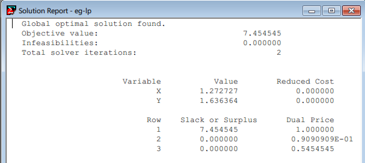

## Linear Programming

### Example 1
- code 
```
max 2x+3y

st
4x + 3y <= 10
3x + 5y < 12
```

- result



### Example 2
We have a 6*8 table, each row represents a source, each column represents a destination, the value in talbe [i,j] represents the cost to diliver goods from i to j. Each source has a capacity and each destimation has a demand requirement. The objective is to
decide how to deliver goods in order to minimize the cost.

- Code
``` LINGO
sets:
  warehouses/wh1..wh6/: capacity;
  vendors/v1..v8/: demand;
  links(warehouses, vendors): cost, volume;
endsets

!objective;
min  = @sum(links: cost*volume);

!demand constraints;
@for(vendors(J):
	@sum(warehouses(I): volume(I,J)) = demand(J));

!capacity constraints;
@for(warehouses(I):
	@sum(vendors(J): volume(I,J)) <= capacity(I));

!data input;
data:
	capacity = 60 55 51 43 41 52;
	demand = 35 37 22 32 41 32 43 38;
	cost = 6 2 6 7 4 2 9 5
		 4 9 5 3 8 5 8 2
		 5 2 1 9 7 4 3 3 
		 7 6 7 3 9 2 7 1
		 2 3 9 5 7 2 6 5
		 5 5 2 2 8 1 4 3;
enddata
```

- result


